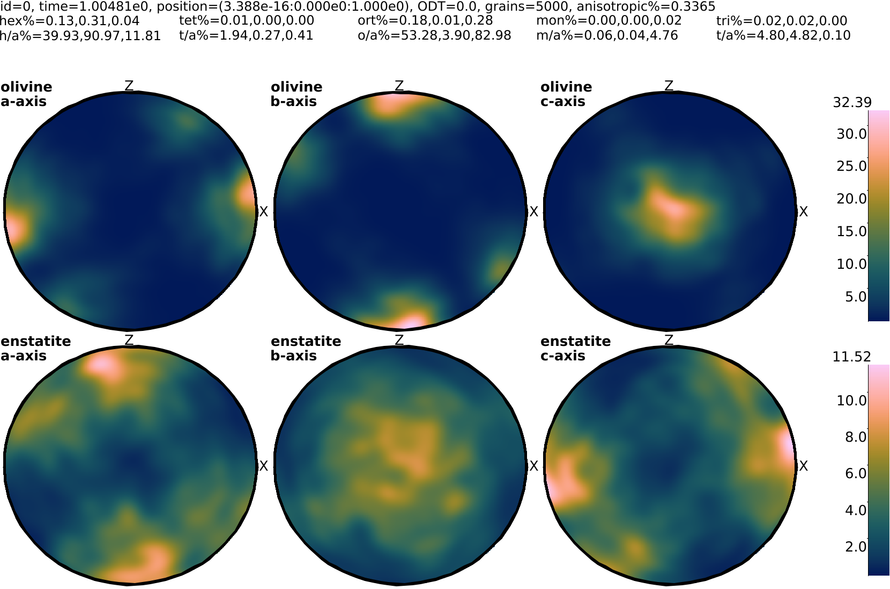

 [](https://travis-ci.com/MFraters/cpo_analyzer) [](https://codecov.io/gh/MFraters/cpo_analyzer)
# CPO analyzer


This crate contains tools to analyzer Crystal/Lattice Preffered Orientation (CPO/LPO) data. It is currently designed to easily create pole figure from the CPO data produced by ASPECT (https://github.com/geodynamics/aspect/issues/3885), but it is not limited to that. However, other type of inputs and plots of analysis are in the scope of this crate.

Note that this crate is a very early (beta) release, and it functions for the specific purpose it was build for, but a lot of functionality that is currently hard-coded can be generalized and expanded if there is interest. This also means that the current interface and input file structure are subject to change.

To run the analyzer, a configuration file is needed. The configuration files are written in the `.toml`  language. Here is a example file to create pole figures from ASPECT data:

 ```toml
 base_dir = "/path/to/base/dir/"
 experiment_dirs = ["experiment_1","experiment2"]
 compressed = true

 [pole_figures]
   elastisity_header = false
   times = [1.0,5.0,10]
   particle_ids = [1,10]
   axes = ["AAxis","BAxis","CAxis"]
   minerals = ["Olivine","Enstatite"]
 ```
 
  The configuration file with some comments (lines starting with a `#`) explaining the options:
 ```toml
 # the location of the experiment dirs.
 base_dir = "/path/to/base/dir/"

 # the directories containing the experiments. Currently only ASPECT output directories
 # are supported.
 experiment_dirs = ["experiment_1","experiment2"]
  
 # Whether the Data was compressed with ZLIB.
 compressed = true

 [pole_figures]
   # Wheter to include elasticity information in the header of the polefigure plots.
   elastisity_header = false

   # For each time in this vector a new polefigure plot is made.
   times = [1.0,5.0,10]

   # For each id in this vector a new polefigure plot is made.
   particle_ids = [1,10]

   # A vector containing the pole figure axis to be plotted. These will be added as a
   # horizontal axis to the plot. Available options are `AAxis`, `BAxis` and `CAxis`.
   axes = ["AAxis","BAxis","CAxis"]

   # A vector containing the minerals to be plotted. These will be added as a vertical
   # axis  to the plot. Available options are `Olivine` and `Enstatite`.
   minerals = ["Olivine","Enstatite"]
 ```

Note that there are more options availble then shown in this example, which are currently only visible in the code (`src/configuration/` dir) and the code documentation. There is also a more elaborate example in the `example` folder.

# Installation
## User installation
The CPO Analyzer is written in rust and starting from version 0.1.0 published on [crates.io](https://crates.io). For this option, first `cargo` needs to be [installed](https://doc.rust-lang.org/cargo/getting-started/installation.html). Then users should be able to use `cargo install cpo_analyzer` to install the program. Note that this installation method is untested until the first publication is made on [crates.io](https://crates.io).
## Developer installation
There are no special instructions for installation by cloning the git repository and running `cargo build` or `cargo run config_file.toml`. Just note that this build the debug version, which is significantly slower than the release version. To build/run the release version add the `--release` flag.
## Dependencies
### Ubuntu Linux
`sudo apt install pkg-config libfreetype6-dev libfontconfig1-dev`
